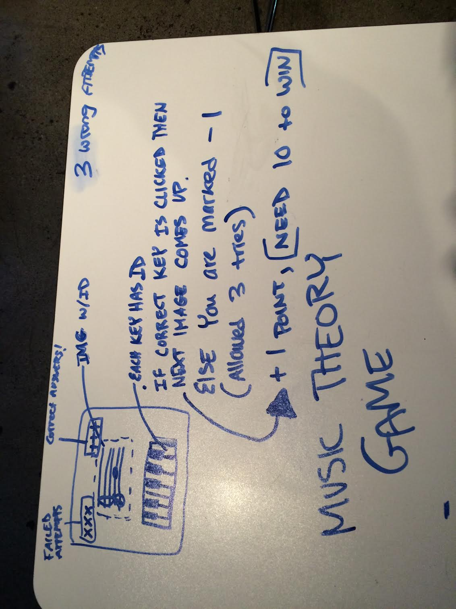
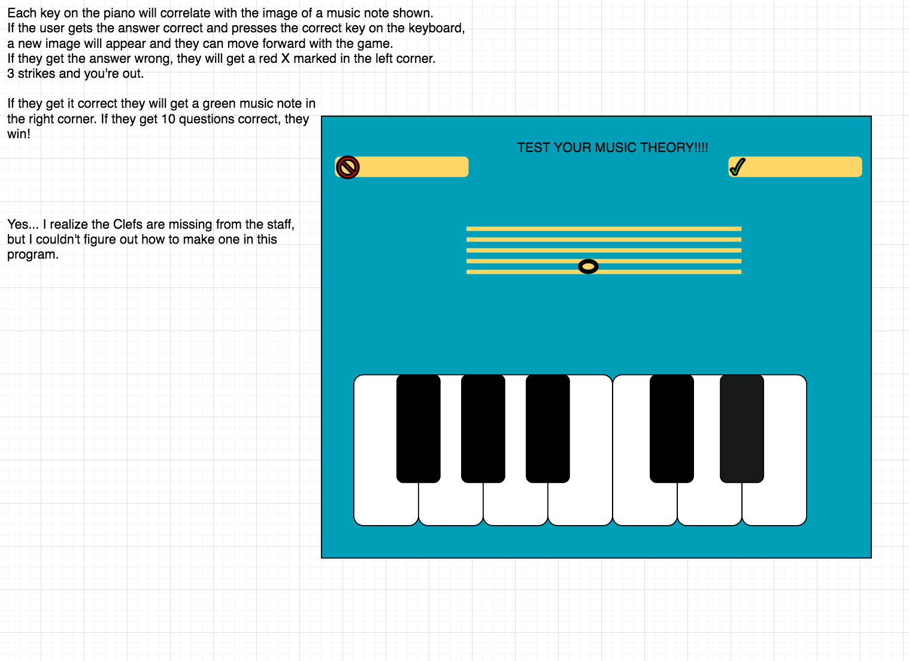

#Music Theory Game - Test Your Sight Reading Skills! Current Name = "Piano Hero" 

###The Idea Behind The Game
Music has always been a big part of my life. Many of my friends work as music educators in public schools all over the country and most of their complaints are about the amount of time that they have to teach both theory and actually start practicing/rehearsing. One of the many problems with Arts Education taking the back-seat for many school districts is that they don't have enough time to go over music theory lessons in addition to getting to practice with their classes. This issue in time and resources for music education has inspired this basic music sight reading game. Education can be fun!!!! :)

####Instructions 

The game displays an image of a musical note or notes on the staff and the player has to press the correct key or key sequence on the piano by clicking the key with their mouse in order to move forward with the game. If they do not press the correct key for the note displayed on the screen, they will have three attempts to get the correct answer. If they do not get the answer correct, the player will be notified that they lost and the game will reset. If the player gets 10 answers correct, they will win the game! There is a reset button so that players can reset the game at any point. 

####Approach Taken

First off, I created the images of the music notes in Adobe Illustrator. I built the piano keyboard in HTML and CSS so that each key could have thier own id. I  then used javascript/jQuery to assign images and win solutions as properties of individual objects. These object properties are passed through an array and compared to the played key in order to determine if the user has gotten the answer correct. I also used jQuery to add an event listener and function to play the associated sound file to each key when clicked.

####Technology Used 
* HTML
* CSS
* JavaScript/jQuery

####Installation Instructions 
* Clone this repo
* Open index.html in Chrome 

####Unsolved Problems 
* Working on a new branch called 'levels' to create a second level in the game with chord progressions. 
* The images move around between bass and treble clef...and it's really annoying me. I want to fix this in Adobe Illustrator. I'm sure it's a problem with the sizing of the images.
* I would like to add a 'life line' option, where you can get a hint if you're struggling with the answer. 
* Game doesn't reset if you win. This ideally will change when the different levels are an option. 
* There are some design elements that I would like to change. However I kept messing things up when I was trying to make some changes. 
* ***	 I want to have a set timeout so the key doesn't play after the alert of win or loss. 
* I would like to make this more styled with bootstrap and responsive CSS.  

#####Wire Frames

##### User Story

[Trello Link](https://trello.com/b/nTNrPKqZ/project-1)
